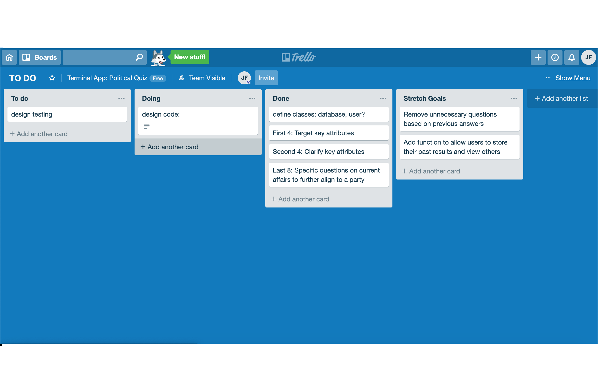

# Terminal App: Political Profiler

## Contributors

Jordan Fasso & Nathan Pallett

____________

## Link

[Political Profile App](https://github.com/joryaboya/Terminal-App-Political-Quiz "Terminal App")

__________

## Purpose

With the federal election approaching, Political Profiler makes your choice easier. Currently the app works through a series of questions and compares the user's response to the three major parties. 

The result? 

+ A similarity percentage of your responses to each individual party, helping users decide who to ultimately vote for in the 2019 election without having to do the research themselves.

The app would provide people who are not as engaged with politics, with an idea of which party their personal beliefs most closely resemble. It also would allow those who are engaged to confirm their prior beliefs. 

It could also be used by the political parties to test how their proposed policies relate to the population.

____
## Functionality 
We compared the users answers to the political parties across four core values over the first twelve questions:

+ Environmentalist
+ Capitalist
+ Humanitarian 
+ Authoritarian

The remaining questions tackle specific topics that are of public interest. These allow us to guage a more accurate representation of where the user is on the political spectrum.

The user will be returned a list in order of percentage compatability with the Liberal, Labor and Greens party, allowing them to determine who they are likely to vote for. 

The user is also able to see their responses in more detail, with the current model allowing not only their overall similarity but their similarity in terms of value based questions and topic based questions.

## Instructions

The app is relatively easy to run. The file 'database.rb' has the required call methods in it to run the quiz immediately. It doesnt require any gems so it can be run locally.

+ To initialise:


```terminal 

$ ruby database.rb

```
+  Make  selection from the main menu

```terminal
  This is the MAIN MENU.

        To choose an option, enter it's corresponding number

        1 - Run Quiz
        2 - View users answers
        3 - Quit Game
```

+ To commence quiz, option 1 is selected

```terminal
Welcome to the Political Profiler, a quiz that compares YOUR answers to the three major political parties!


        In this quiz, you will be asked how much you agree with a political statement by entering and integer between 1 and 5.

        1: Strongly Disagree
        2: Disagree
        3: Neutral
        4: Agree
        5: Strongly Agree
        
        You will be asked 24 questions for accuracy. Please answer honestly.

        Type your name and press ENTER to continue.
```

+ After entering the users name, the users answers the questions that follow

```terminal
1. The free market is more important than sustaining the environment
        
5

        2. Punishing the unlawful is more important than supporting the citizens
        
4

        3. Leniance on criminals is a valid sacrifice for the growth of the economy
        
3

        4. Neglecting the environmental impact of programs is justified if it improves the lives of the people
        
2

        5. The goverment should allow sale of agriland to foreign buyers at the expence of the enviroment.
        
1

        6. Sunday pay should stay at double wages.
        
```
+ The users answers are compiled and the quiz returns their similarity percentages in decreasing order

```terminal
LIBERAL
Your responses are 50.72% similar to liberal party
GREENS
Your responses are 46.13% similar to greens party
LABOR
Your responses are 31.59% similar to labor party
```

+ The user is then prompted with a menu to see if they would like further information

```terminal 
 Would you like to see more detailed similarities?
                
            1. Yes, I would like my values results!

            2. Yes, I would like my topics results!
            
            3. No, I would like to exit
```


## Ethical Issues

The main issue we faced in development was that some of the topic specific questions could possibly be viewed as controversial. These questions were not omitted as they are current event type of topics that relate directly to the election. As such we decided it would be appropriate to represent party similarities to these topics as a whole rather than feedback for each individual question.

This gives the user a more objective result as they cannot directly compare how similar they are on one topic and doing so could marginalise the integrity of the quiz.

We had also originally planned to have a function allowing users to see passed user responses to the questionairre yet decided against. This protects the individual from potentially scrutiny and their rights to express opinion. 

____

# Design Plan

### Notebook

We first planned on paper to outline what the function of the app would be, and how it would run based on the set of questions we wanted to asked.


### Timeline

Day 1: 

The morning was used to plan the idea of a political party quiz. We discussed which was the best way to store the data before deciding they should be adjustable attributes

In the afternoon we set up our Trello flowboard and the git repository we were to use before begining to code. We finished the initialising of the database class, and began to figure out how we would use the similarity comparisons

Day 2:

We obtained our first working model of the app before lunch and had to make adjustments to how the results were displayed. 

Thereafter we needed to do some testing as well as formatting the menus as our app is heavily text based


### Trello Use

+ The fluidity of trello was used to track tasks as seen below




### Coding Progression

+ We had to define a database which would hold the information required for the entire quiz.

+ The database was initialised with attributes that had baseline scores for the instance user to adopt when created.

+ These attributes were altered by the users response to questions. This was done so by implementing methods for each question to alter the value of the attribute

+ The attributes were centred around positive scores, with the lower bound > 0 to ensure the percentage methods would not be negative

+ We designed menus to introduce the user to the quiz, a simple number based menu served us here with if statements controlling the outcome

+ We designed a method to carry out all the question methods on the user

+ Then the results method was created, which gathered information from the users input and compared it the stored political party results. Returning the percentage similarity.

+ The overall percentage similarity method was designed to take in the total differences, whereas the later defined values and topics similarity methods were using a subset of the attributes to make comparisons


### User Stories

+ As a user I want to be able to see which party I should vote for

+ As a political party I want to see how we compare to the public

+ As a user I want to see how similar I think to partys on specific topics

### Testing 

*Note:  Testing was completed in 'pry'*

1. This was a positive test for the main menu to determine if good input was provided, the quiz would progress to the next stage

```terminal

[1] pry(main)> user1.main_menu

        This is the MAIN MENU.

        To choose an option, enter it's corresponding number

        1 - Run Quiz
        2 - View users answers
        3 - Quit Game
1
POSITIVE TEST PASSED

Welcome to the Political Profiler, a quiz that compares YOUR answers to the three major political parties!
```

2.  This was a negative test for the main menu to see how it would react when a "string" was passed into the input

```terminal
[2] pry(main)> user1.main_menu

        This is the MAIN MENU.

        To choose an option, enter it's corresponding number

        1 - Run Quiz
        2 - View users answers
        3 - Quit Game
string
Please enter a valid input
NEG TEST PASSED
```
3. This was a negative test to check that the questions would only take values from 1-5 based on the spectrum we predetermined

```terminal 
[1] pry(main)> quiz_run(user1)

        1. The free market is more important than sustaining the environment
        
56
Invalid input
NEG TEST PASSED
```

4. This was a positive test to ensure the comparisons printed correctly when good input was given

```terminal 
[1] pry(main)> user1.see_stats

                Would you like to see more detailed similarities?
                
            1. Yes, I would like my values results!

            2. Yes, I would like my topics results!
            
            3. No I would like to exit
            
1
LIBERAL
Your responses are 67.31% similar to liberal values
LABOR
Your responses are 42.31% similar to labor values
GREENS
Your responses are 42.31% similar to greens values
Positive test PASSED
```

5. This was a negative test to ensure a warning was printed when bad input was given to the stats menu

```terminal
[2] pry(main)> user1.see_stats

                Would you like to see more detailed similarities?
                
            1. Yes, I would like my values results!

            2. Yes, I would like my topics results!
            
            3. No I would like to exit
            
rrv
Sorry please enter a valid option
NEG TEST PASSED
```


### Challenges Faced

+ We should have separated the database so it could solely store the values and topics attributes of each party. Along with storing the questions

+ The code was extremely repetative given the number of questions, condensing became an issue in navigating the file and should have used a module to contain certain methods in order to reduce it. 

+ Creation of a separate "User" class rather than having the database generate an instance user would have made for a cleaner code. There was too much overlap within the one class meaning we couldnt reach our initial goal of being able to store and compare user results.

### Stretch Goals

+ Adding more political parties to the database would mean people could gain higher similarity percentages to parties that are not included than the three major ones.

+ Adding gems that could make the app more accessible than current model

+ Condensing the questionaire without compromising the accuracy of the results, to make it more user friendly and give a more unique experience.

+ Allow function to view past results without compromising each individual answers privacy. Building another database that stores everyones answers and would give a population based comparison rather than comparing individuals.

+ Change answer key to give more specific responses, rather than a set spectrum of agreement.

+ Having a function that would give the user a link that provides context specific to the question being asked, in order to make a more informed decision.
